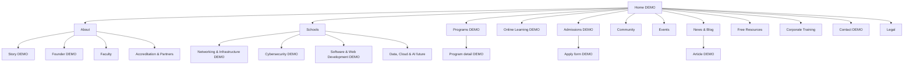

# Sitemap v2 — University-Grade Online Academy

Back to [[00 Home]] · Strategy: [[Strategy v2 - IT Academy]] · Design: [[Design System v2]]

**[DEMO]** marks pages the HTML demo v2 should build (target: 14 pages). Other pages are the complete production IA.

## Primary IA

## Page inventory

| Area | Pages | Demo v2 |
|---|---|---|
| Home | Home, global search, language selector | **Build** |
| About | Story, Founder, Faculty, Accreditation/Partners, Careers | Story + Founder **Build** |
| Schools | Index; Networking & Infrastructure; Cybersecurity; Software & Web Development; Data, Cloud & AI (future) | Index + 3 current schools **Build** |
| Programs | Listing with filters (school, level, mode, duration); programme detail template | Listing + CCNA detail **Build** |
| Online Learning | How it works, LMS, virtual labs, learner support | How it works **Build** |
| Admissions | How to apply, entry requirements, fees/payment plans, scholarships, apply form | Admissions + apply form **Build** |
| Student life | Community, learner stories, events calendar, student support | Community **Build** |
| Publishing | Events listing/detail; News/Blog listing/article; Free Resources | News listing + article **Build** |
| Commercial | Corporate Training | Contact-style landing page |
| Utility | Contact, FAQ, accessibility, search, 404 | Contact + FAQ **Build** |
| Legal | Privacy, terms, refund policy, cookie notice, Cisco/trademark disclaimer | Link placeholders |

## Mega-menu

| Menu | Columns | Featured action |
|---|---|---|
| About | Story · Founder · Faculty · Partners · Careers | Meet Yasiru |
| Schools | Networking · Cybersecurity · Software/Web · Future Data/Cloud/AI | Explore all schools |
| Programs | All programmes · Foundation · Certificates · Diplomas · Future pathways | Find your path |
| Online Learning | How it works · LMS · Virtual labs · Support | See the learning experience |
| Admissions | How to apply · Requirements · Fees · Scholarships | Apply now |
| Community | Student life · Events · News · Resources | Join the community |

Persistent header CTAs: **Explore programs** and **Apply / enquire**. Mobile menu becomes an accordion, never a tiny desktop mega-menu.

## Demo page set (14)

1. Home
2. About / Story
3. Founder / Lead Instructor
4. Schools index
5. School of Networking & Infrastructure
6. School of Cybersecurity
7. School of Software & Web Development
8. Programs listing
9. CCNA programme detail
10. Online Learning / How it works
11. Admissions
12. Apply / enquire
13. News & Blog listing
14. Contact + FAQ (combined utility page for demo)

## URL and content rules

- Use stable slugs: `/schools/networking-infrastructure/`, `/programs/ccna-200-301/`, `/online-learning/`, `/admissions/`.
- Programme cards must expose school, level, duration, mode, status, and CTA.
- Every page has breadcrumb/page-title treatment except Home.
- Mark future schools and all placeholder data with **Demo info — to be confirmed**.
- A production Sinhala mirror may use `/si/` after translation and content QA; do not ship machine-translated copy as final.

## Summary

The IA makes SLTSC feel larger than one course without pretending to be a university today: schools provide the future structure, programmes drive conversion, and learning/admissions/community pages provide the institutional depth.
