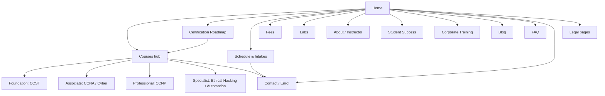

> [!warning] Superseded by v2 — see [[Client Facts (Confirmed)]] and [[Demo v2 Build]]

# Sitemap
Back to [[00 Home]] · Pages detailed in [[Page Wireframes]] · Courses in [[Course Catalog]]

```
Home
├── Courses (hub)
│   ├── Foundation
│   │   ├── CCST Networking
│   │   └── CCST Cybersecurity
│   ├── Associate
│   │   ├── CCNA 200-301
│   │   └── CyberOps / Cybersecurity Associate
│   ├── Professional
│   │   ├── CCNP Enterprise
│   │   └── CCNP Security
│   └── Specialist
│       ├── Ethical Hacking
│       └── Network Automation / Python
├── Certification Roadmap
├── Schedule & Intakes
├── Fees
├── Labs
├── About / Instructor
├── Student Success
├── Corporate Training
├── Blog
├── FAQ
├── Contact / Enrol
└── Legal
    ├── Privacy Policy
    ├── Terms & Refund Policy
    └── Trademark / Cisco Disclaimer
```



## Notes
- Every course page links to Schedule, Fees and Enrol.
- Sinhala version mirrors the tree (`/si/`).
- Only publish pages for courses marked offered in [[Course Catalog]].
- Student Success: only verified numbers ([[Content Checklist (Waiting on Client)]]).
